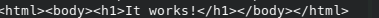
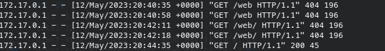
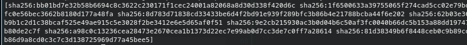

## Lab-04
---

# 1. Crear una imagen con un servidor web Apache y el mismo contenido que en la carpeta content (fijate en el Dockerfile con el que cree simple-nginx)
docker build . -t simple-apache:new

# 2. Ejecutar un contenedor con mi nueva imagen
docker run -d --name myapache -p 5050:80 simple-apache:new

# 3. Averiguar cuántas capas tiene mi nueva imagen
docker inspect simple-apache:new #En el apartado "Layers" pueden contarse cuántas capas hay

docker history simple-apache:new #Todas las acciones que son < 0B son capas

docker image inspect simple-nginx -f '{{.RootFS.Layers}}'


Dockerfile

```
#Imagen que voy a utilizar como base
FROM nginx:alpine

#Etiquetado
LABEL project="bootcamp"

#Como metadato, indicamos que el contenedor utiliza el puerto 80
EXPOSE 80

#Modificaciones sobre la imagen que he utilizado como base, en este caso alpine
COPY content/ /usr/share/nginx/html/
```

### Entrega
- Documentación
- Print de pantalla con los resultados.

### Resolución

#### Parte 1

1. Crear un Dockerfile con apache alpine 

```
#Imagen que voy a utilizar como base
FROM httpd:alpine

#Etiquetado
LABEL project="bootcamp"

#Como metadato, indicamos que el contenedor utiliza el puerto 80
EXPOSE 80

#Modificaciones sobre la imagen que he utilizado como base, en este caso alpine
COPY content/ /var/www/html/

```

2. Construir el contenedor

```
docker build . -t simple-apache:new

```

3. Ejecutar el contenedor con la imagen creada

```
docker run -d --name myapache -p 5050:80 simple-apache:new

```
4. Corroborar con curl

```
curl localhost:5050

```


5. Abrir otra consola y ver los logs de accesos en apache

```
docker log -f simple-apache:new

```



6. Ver las capas 

```
docker image inspect simple-apache:new -f '{{.RootFS.Layers}}'

```



