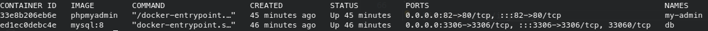

## Lab-01
---

### Parte 1

Go to [Docker Hub](https://hub.docker.com/) y busque la imagen de Nginx. Descarga la version 1.22.1

Crea un script con el nombre 1-nginx.sh que permita descargar la imagen

---

### Parte 2

Paso por paso como ejecutar un par de contenedores de `MySQL` y de `PHPMyAdmin` que estén conectados entre si.

1. Inicia container de MySQL: `docker run --name=db -p 3306:3306 -e MYSQL_ROOT_PASSWORD=secret-pw -d mysql:8`
   1. Puedes revisar los logs del contenedor con `docker logs db`
   2. Puedes conectarte al contenedor con `docker exec -it db bash` y luego conectarte a MySQL por medio del comando `mysql -u root -p`
   3. Para salir de la terminal interactiva del contenedor, primero hay que salir de `MySQL` por medio de `exit`, y una vez fuera podemos tecler la combinación `Ctrl+P` y `Ctrl+Q` para salir. Esto no detendrá nuestro contenedor

2. Inicia container de `PHPMyAdmin`: `docker run --name=my-admin -p 82:80 --link db:db -d phpmyadmin`
   1. Podrás ver tu contenedor de `PHPMyAdmin` corriendo desde <http://localhost:82/>
   2. Una vez ahí introduce las credenciales correctas para acceder y comenzar a jugar con tus contenedores

3. Una vez que realices todas las pruebas, asegúrate de detenerlos y borrarlos utilizando `docker stop` para detenerlos, y `docker rm` para removerlos

### Entrega
- Documentación
- Print de pantalla con los resultados.


### Resolución

#### Parte 1
1. Instalar primeramente docker en el host.
-- Centos:   yum install docker
-- Ubuntu:   apt install docker
-- Windows:  Intall Docker Desktop

2. Correr script docker.sh
   - chmod o+x docker.sh
   - $./docker.sh
   - Con el comando images ver si se descargo la imagen
   ```
   docker images
   ``` 
   

#### Parte 2

1. Correr los comandos de docker

```
docker run --name=db -p 3306:3306 -e MYSQL_ROOT_PASSWORD=secret-pw -d mysql:8
``` 

```
docker run --name=my-admin -p 82:80 --link db:db -d phpmyadmin
```

2. Verificar si los contenedores estan corriendo

```
docker ps 

``` 
   

3. Verficar la conexion mediante curl ó navegador

```
curl locahost:82 

``` 
ó

   


4. Crear un script para automatizar el despliegue del challenge deploy.sh 


