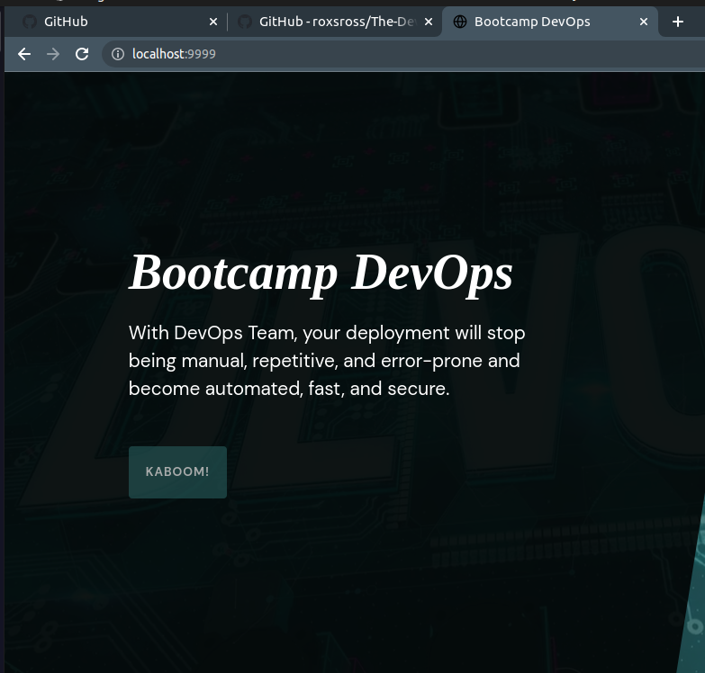

# Resolución Challenge 03


- Creamos el servidor Nginx con el nombre de bootcamp-web, se copian los archivos desde mi pc local a /usr/share/nginx/html y se mapea mi puerto local 9999 al puerto 80 del contendor.

```
docker run --name bootcamp-web -v /home/esteban/Desktop/devops/The-DevOps-Journey-101/CLASE-04/Challenge/03/web:/usr/share/nginx/html -p 9999:80 -d nginx
```

- Ingresamos al contendor

```
docker exec -it bootcamp-web bash 
```

- Ya en la ruta, mostramos los archivos que se han copiado correctamente

```
root@8e5a2c238da9:/usr/share/nginx/html# ls
assets	css  index.html  js
```

- Prueba de que se ha funcionado

```
docker ps
CONTAINER ID   IMAGE     COMMAND                  CREATED          STATUS          PORTS                                   NAMES
8e5a2c238da9   nginx     "/docker-entrypoint.…"   13 minutes ago   Up 13 minutes   0.0.0.0:9999->80/tcp, :::9999->80/tcp   bootcamp-web

```


