# Lab-05
---
## Contenerización la aplicación Flask y Consumer

Este ejemplo crea una API basica de flask, con un consumidor que accede desde el service de la API.

Lenguaje: Python
Version: >3.8

### Arquitectura

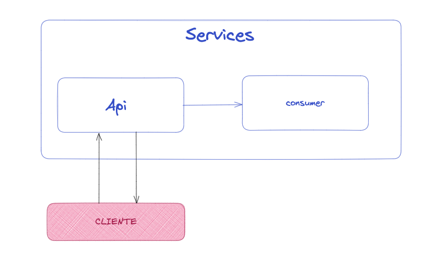

```
src
├── app
│   ├── app.py
│   └── templates
│       └── index.html
└── consumer
    └── consumer.py
```

## API flask

Puerto: 8000

#### Resultado API flask
curl localhost:8000
```
> curl localhost:8001
<!DOCTYPE html>
<html lang="en">
<body>

<h2>Hotname: e8a97746772c</h2>
<p>IP Address: 172.17.0.7</p>

</body>
</html>%  
```
#### Consumer

> host: service service-flask-app "Container_name"

Para el consumer es necesario las variables:
```
LOCAL=true
PYTHONUNBUFFERED="1"
``` 

#### Resultado consumer
```
Run container on local
Response OK!!!
Response OK!!!
Response OK!!!
Response OK!!!
Response OK!!!
```

### Entrega
- Documentación
- Print de pantalla con los resultados.
- Dockerfile API y Consumer
- Subir la Api y consumer a Docker-hub
- Docker-compose.yml


### Resolución

#### Parte 1

##### Probar la applicación y el consumidor de python SIN DOCKER y ver cómo trabaja

1. Aplicación utilizando Ubuntu18.04. 
2. Instalar python3 , python3-pip and flash
3. Ir a src/app y ejecutar la app (servicio 1)

```
python3 app.py
```

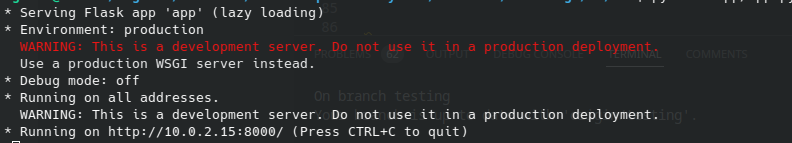

4. Ir a src/consumer, modificar lineas 13 y 16  y ejecutar el consumer (servicio 2) 

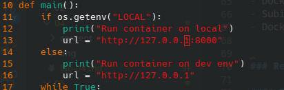

```
LOCAL=true python3 consumer.py
```
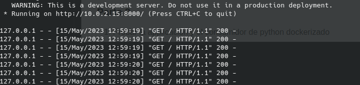


#### Parte 2 

##### Probar la applicación y el consumidor de python CON DOCKER

###### Contenedores por separado (dos Dockerfiles)

1. Crear Dockerfile para la app (servicio 1) y requeriments.txt

Dockerfile de la app

```
FROM python:3.8
RUN mkdir /app
RUN mkdir /app/templates
WORKDIR /app
ADD requirements.txt /app
ADD app.py /app
ADD templates /app/templates
RUN pip install -r requirements.txt
EXPOSE 8000
CMD ["python3", "app.py"]
```

requirements.txt

```
flask
```

2. Construir la imagen del Dockerfile y asignarle el nombre de app

```
docker build . -t app
```

3. Correr la imagen como service-flask-app escuchando en el puerto 8000

```
docker run -p 8000:8000 --name service-flask-app app
```

4. Comprobar que está corriendo el contenedor

```
docker ps
```
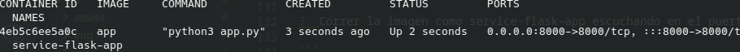

5. Ingresar al contenedor o mediante inspect conocer que ip tiene asignado el contenedor de la app (más adelante está ip será utilizada)

6. Desde otra consola ejecutar el consumer, cambiar la url a localhost y  pasar el parámetro de LOCAL como true y ver los mensajes de OK!!


```
$ LOCAL=true python3 consumer.py 
```

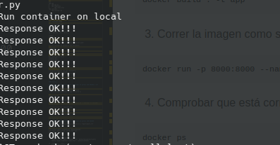


7. Sabiendo que se el consumer.py se puede conectar, ahora vamos a llevar el consumer a un Dockerfile.

8. Antes del Dockerfile, modificar temporalmente el consumer.py y asignarle la ip del contenedor de la app

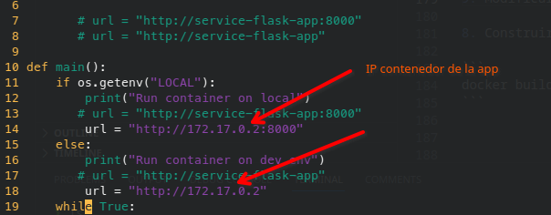

9. Crear el Dockerfile para el consumer.py y pasar variable de entorno LOCAL a true

Dockerfile para el consumer

```
FROM python:3.8
RUN mkdir /app
WORKDIR /app
ENV LOCAL=true
ADD requirements.txt /app
ADD consumer.py /app
RUN pip install -r requirements.txt
CMD ["python3", "consumer.py"]

```
10. Crear el requirements.txt para el consumer

requirements.txt

```
requests==2.27.1
```

11. Construir la imagen del Dockerfile y asignarle el nombre de consumer

```
docker build -t consumer
```

12. Correr el contenedor del consumer

```
docker run -d consumer
```

13. Comprobar o loguear los accessos a la app

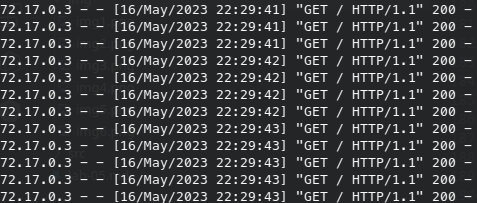


14. Comprobar la ejecución de los 2 contenedores corriendo

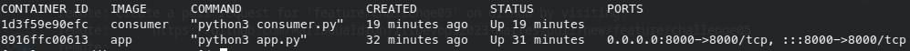


###### Contenedores juntos (docker-compose)

1. Por último, sabiendo que ambos contenedores están funcionando y corriendo ahora es el momento de correrlos ambos juntos con docker-compose

2. Restaurar a su version original el consumer.py 

3. Crear docker-compose.yml en el directorio src

```
version: "3"

services:
  app:
   build: ./app
   container_name: service-flask-app
   ports:
      - "8000:8000"

  consumer:
   build: ./consumer
   environment:
       LOCAL: "true"

```

4. Correr el docker-compose en modo verbose (para ver si levantan los contenedores)

```
docker-compose up 
```

5. ó correr el docker-compose en modo background 

```
docker-compose up -d
```

6. Comprobar que los contenedores están corriendo

```
docker ps
```

7. Comprobar que el nombre del contenedor de la app se llame "service-flask-app"

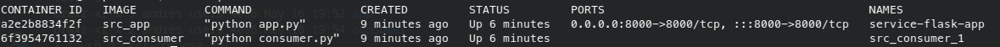


8. Por último, comprobar que ambos contenedores se  conectan mediante la opción de logs de docker y el id correspondiente de cada contenedor

```
docker logs -f <id consumer>
```

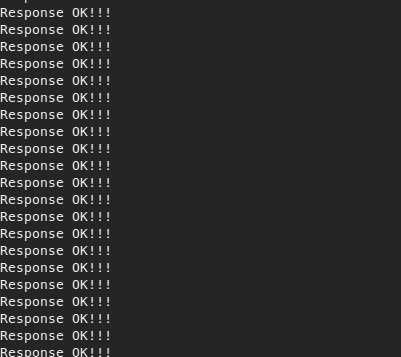

```
docker logs -f <id app>
```

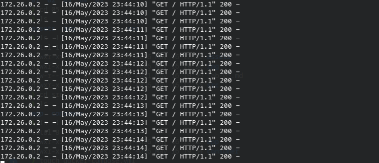


9. Ver mediante dos consolas ambos corriendo


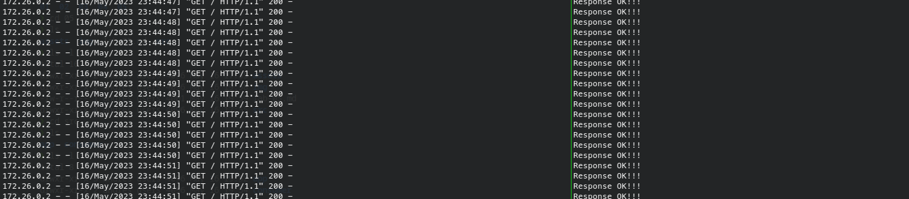
