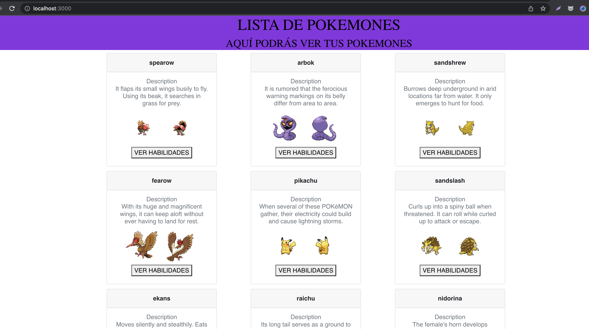

# Lab-07
---

## POKEMON DOCKER COMPOSE CHALLENGE 

La empresa ZERO Technology, solicita al Equipo de DevOps Trainer, la contenerizacion de su aplicacion "Pokemon DevOps" en la que incluye:

- Backend
- Frontend

### Especificaciones:

- El Backend esta realizado en FASTAPI y Python (python:3.8 ó superior) el backend consume la API publica HTTPS://POKEAPI.CO/API/V2/

- El frontend es realizado en React (node 14 ó 16)

### Requerimientos: 

- Se debe contenerizar la aplicación, para ello se debe crear un dockerfile para el backend y frontend

- Para construir un contenedor del backend ejecutamos lo siguiente:

```
cd backend-pokemon-app
docker build -t backend_pokemon:1.0.0 .

```

Este comando debe ser ejecutado en la raiz del directorio backend-pokemon-app  ya que el . indica que el dockerfile se encuentra ahi.
una vez echo esto se crea un contenedor a partir de la imagen construida anteriormente

```
docker run -d -p 8000:8000 backend_pokemon:1.0.0
```

- luego podra ir a la ruta http://localhost:8000 y ver la API funcionando, para
obtener documentacion de la api vaya a la ruta http://localhost:8000/docs


- Este proceso se debe seguir para desplegar el frontend en un container por separado este comando debe ser ejecutado en la raiz del directorio frontend-pokemon-app  ya que el . indica que el dockerfile se encuentra ahi.

```
docker build -t frontend_pokemon:1.0.0 .
```

- Una vez echo esto se crea un contenedor a partir de la imagen construida anteriormente

```
docker run -d -p 3000:3000 frontend_pokemon:1.0.0
```

- Para acceder podra ir a la ruta http://localhost:3000 y podra ver el sitio web
el cual internamente se conecta a la API que previamente ya se desplego en un container aparte y tiene expuesto el puerto 8000

- Para el frontend en la ruta frontend-pokemon-app/poke-react
se encuentra el archivo .env el cual contiene la  variable de entorno que indican
el entorno en que se quiere ejecutar 

- Esto hara que el frontend se comunique al servicio expuesto en docker-compose, ya que desea ejecutarlo localmente


### Entrega:

- Dockerfile Frontend y Backend
- Subir la Imagen del Frontend y Backend al Registry Docker Hub con versionado
- Docker-compose
- Documentación


## Resultado




## Solución

- Dockerfile backend

[Link a la imagen subida en dockerhub](https://hub.docker.com/r/estebandem/backend_pokemon)

```
FROM python:3.8
WORKDIR /app
COPY requirements.txt .
RUN pip install -r requirements.txt
COPY . .
EXPOSE 8000
CMD [ "uvicorn", "main:app", "--host", "0.0.0.0", "--port", "8000" ]
```

- Dockerfile frontend

[Link a la imagen subida en dockerhub](https://hub.docker.com/r/estebandem/frontend_pokemon)

```
FROM node:16-alpine
WORKDIR /app
COPY package.json .
COPY .env .
RUN npm install
COPY . .
EXPOSE 3000
CMD ["npm", "run", "start"]
```

- Docker Compose aplicación

_Recordar agregar en /etc/host el alias de_

```
127.0.0.1       backend
```

```
version: '3'
services:
  back_fastapi:
    image: estebandem/backend_pokemon:1.0.0
    ports:
      - 8000:8000
    networks:
      my-network:
        aliases:
          - backend

  front_react:
    image: estebandem/frontend_pokemon:1.0.0
    ports:
      - 3000:3000
    environment:
      - REACT_APP_URL_PRODUCTION=http://backend:8000
    networks:
      my-network:

networks:
  my-network:
```
