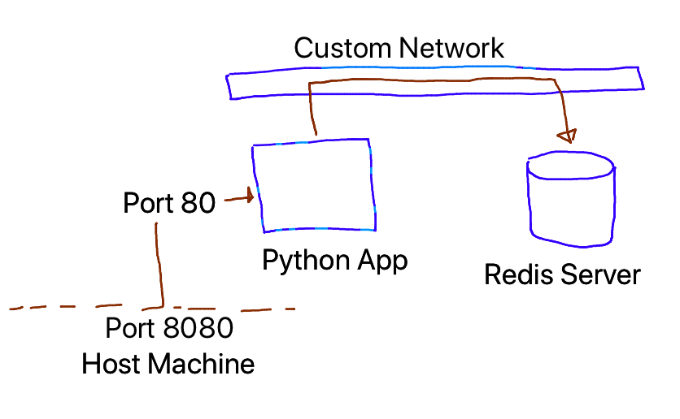
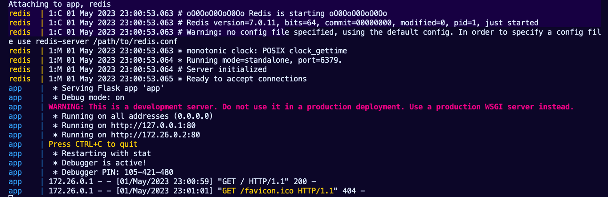
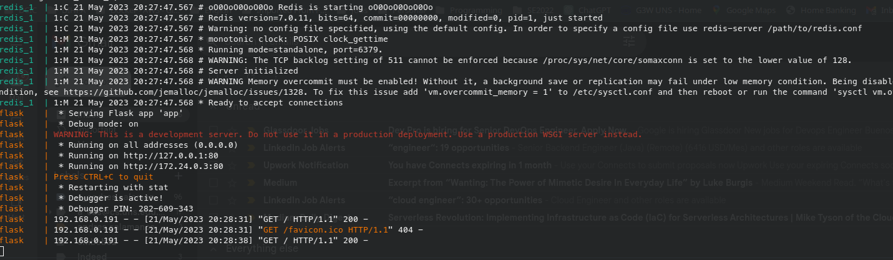

# Lab-08 
---
#### Docker Compose [Python Redis]

La empresa ZERO Technology, solicita al Equipo de DevOps Trainer, la contenerizacion de su aplicacion "Python"



### Entrega

- Se debe Armar un Docker-Compose 
- Se recomienda revisar el app.py como será la comunicacion con la redis.
- Documentación




### Resolución

#### Parte 1

1. Crear Dockerfile para la aplicacion de python

Dockerfile 

```
FROM python:3.8
RUN mkdir /app
WORKDIR /app
ADD requirements.txt /app
ADD app.py /app
RUN pip install -r requirements.txt
EXPOSE 80
CMD ["python3", "app.py"]
```

2. Crear docker-compose para correr ambos contenedores 

Docker-compose

```
version: "3"
services:
  redis:
   image: redis
   ports:
      - "6379:6379"

  flask:
   build: .
   container_name: flask        
   ports:
      - "8080:80"
   depends_on:
      - redis
```

3. Ejecutar el docker-compose y corroborar apuntar al 8080 de la aplicación




