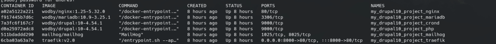
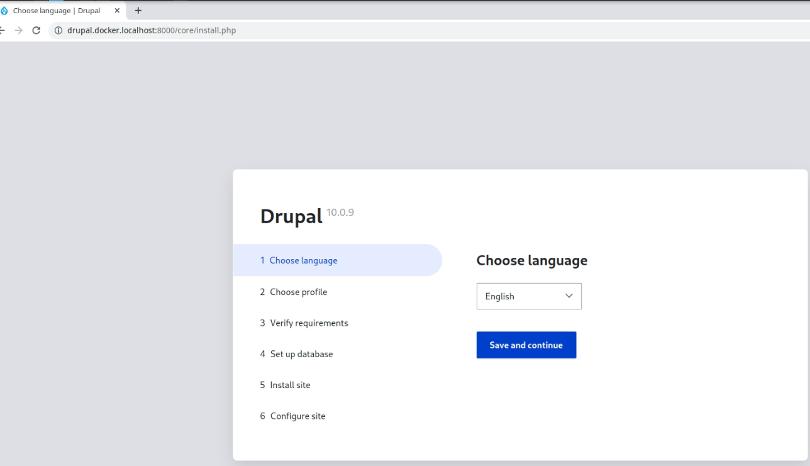
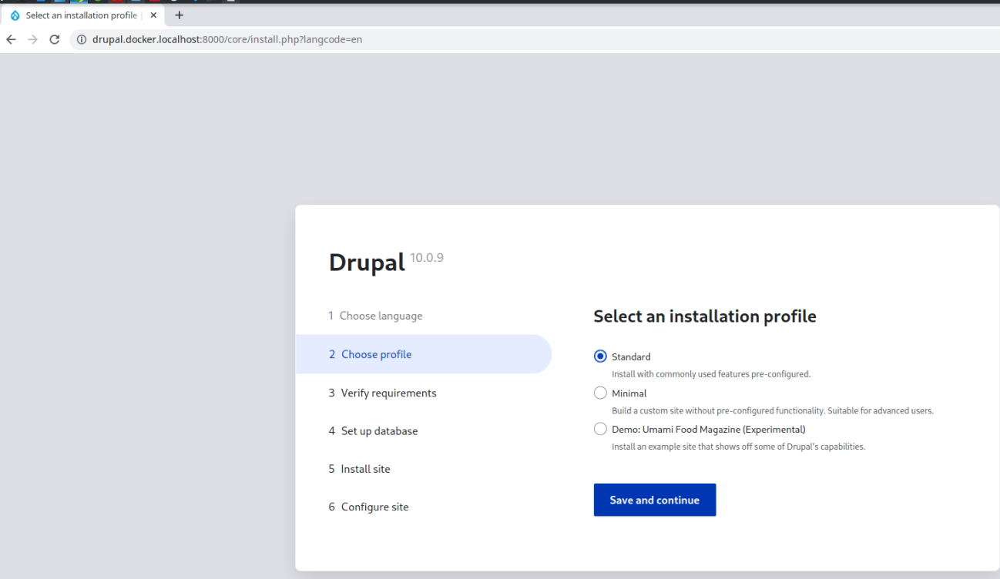

# Lab-09
---
### Despliega un proyecto Drupal utilizando Docker

Para ello vamos a tomar como referencia el repositorio de docker4drupal creado por el equipo de Wodby, en la dirección: https://github.com/wodby/docker4drupal.

```
$ git clone https://github.com/wodby/docker4drupal.git
Que copiará en nuestra máquina todo el contenido del repositorio. A partir de ahí, y con Docker y Docker-Compose ya instalado en nuestro entorno, solo tenemos que ejecutar la siguiente instrucción para levantar todo el sistema:

```
```
$ cd docker4drupal
$ docker4drupal$ docker-compose up -d
#Que inmediatamente levantará la red de contenedores pre-configurada:

Starting docker4drupal_crond_1  ... done
Starting my_drupal9_project_php  ... done
Starting my_drupal9_project_traefik ... done
Starting my_drupal9_project_mariadb ... done
Starting my_drupal9_project_nginx   ... done

```
A partir de este momento, podemos consultar los contenedores levantados en nuestro sistema ejecutando la instrucción:

`$ docker ps`

#### ¿Qué contenedores tienes habilitados por defecto? 

- MariaDB, como motor de bases de datos.
- PHP para contener y ejecutar el código de Drupal.
- crond para ejecutar el cron.
- Nginx como servidor web.
- Mailhog, como servidor de correos para pruebas de envío.
- Portainer, como herramienta visual para gestionar contenedores (aporta una interfaz web de administración de - la red de contenedores que puedes abrir en tu navegador web).
- Traefik, como proxy inverso de la red interna de Docker para gestionar las conexiones a los contenedores.


Repositorio: https://github.com/wodby/docker4drupal


### Entrega:
    - Documentación de como solvento el proceso de instalación
    - print de pantalla con los servicios habilitados y funcionando.


### Resolución

#### Parte 1

1. Clonar repo desde https://github.com/wodby/docker4drupal.git

2. Movernos a docker4drupal y ejecutar docker-compose up -d

3. Ver todos los contenedores que están corriendo



4. Qué contenedores están corriendo ?

- MariaDB, como motor de bases de datos.
- PHP para contener y ejecutar el código de Drupal.
- crond para ejecutar el cron (no sé cuál es la función de este contenedor)
- Nginx como servidor web.
- Mailhog, como servidor de correos para pruebas de envío (drupal lo usa como servidor para envio de mails)
- Traefik, desde afuera se le apunta a este proxy inverso y es èl el que se encarga de routear a los distintos contenedores. En nuestro caso sólo routea a drupal puerto 8000





