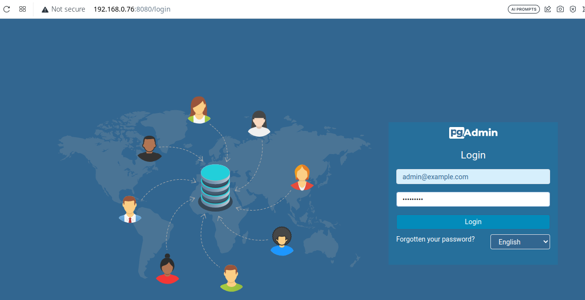
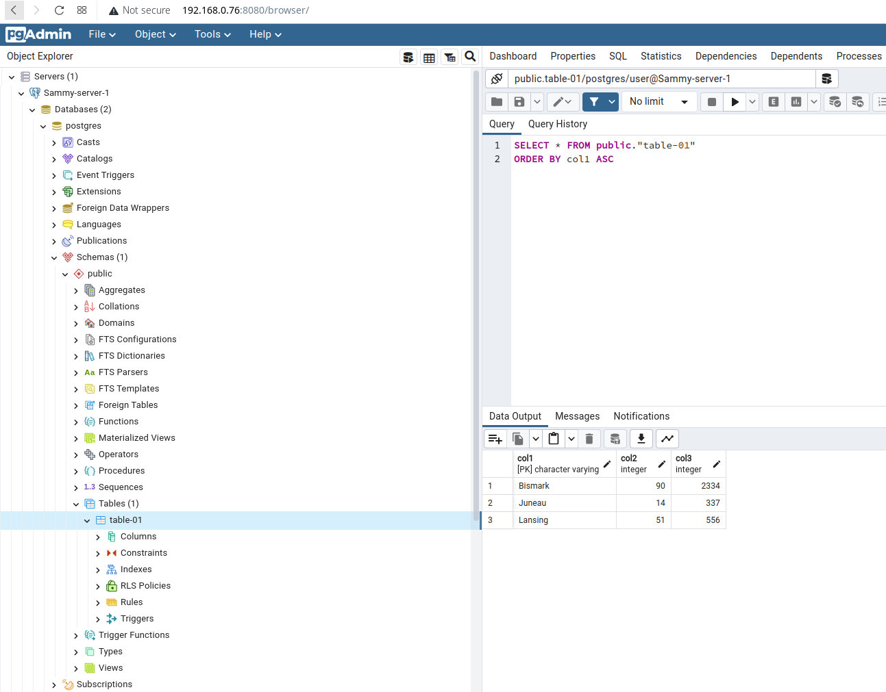
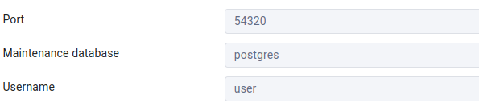

# Lab-10
---

Este Challenge se enfoca en trabajar con el contenedor con la BD `PostgreSQL`, el cual podremos visualizar por medio de `pgAdmin`, todo orquestado por medio de `Docker Compose`.

### Desplegar PostgreSQL y PgAdmin 


1. Ejecuta el comando `docker-compose up -d --build` y espera a que ambos contenedores estén listos
2. Visita `pgAdmin` por medio de la URL <http://0.0.0.0:8080> y haz login con las credenciales que vienen en el [docker-compose.yml](docker-compose.yml)
   1. `PGADMIN_DEFAULT_EMAIL: admin@example.com`
   2. `PGADMIN_DEFAULT_PASSWORD: secret123`

3. Crea un nuevo server por medio de la interfaz de `pgAdmin` pero en esta ocasión para el servicio de `db` (`POSTGRES_USER: admin` y `POSTGRES_PASSWORD: secret123`)

4. Una vez establecida la conexión con el servidor de `PostgreSQL` correctamente, y en caso de que desees jugar y aprender un poco con la interfaz de `pgAdmin`, puedes referirte a la siguiente documentación para crear una tabla por medio del panel de `pgAdmin`, y después de eso comenzar a insertar registros en ella

   1. <https://www.digitalocean.com/community/tutorials/how-to-install-configure-pgadmin4-server-mode-es#paso-6-crear-una-tabla-en-el-panel-de-pgadmin>
   
5. Ya que hayas terminado de utilizar los contenedores puedes proceder a removerlos utilizando el comando `docker-compose down -v --rmi all`, esto detendrá y removerá los contenedores en ejecución, juntos a los volúmenes que también se crearon para cada servicio y de paso las imágenes que se descargaron del registro de `Docker`

## Recursos

- <https://docs.docker.com/compose/>
- <https://www.postgresql.org/>
- <https://hub.docker.com/_/postgres>
- <https://www.pgadmin.org/>
- <https://hub.docker.com/r/dpage/pgadmin4/>

### Resolución

#### Parte 1

1. Crear docker-compose para los servicios de pgadmin y la database. Tener en cuenta que se crean dos volumenes, uno para guardar la data de 
la databse y el otro para la interface de pgadmin

docker-compose.yml

```
version: "3.8"
services:
  db:
    image: postgres
    container_name: local_pgdb
    restart: always
    ports:
      - "54320:5432"
    environment:
      POSTGRES_USER: user
      POSTGRES_PASSWORD: secret123
    volumes:
      - local_pgdata:/var/lib/postgresql/data
  pgadmin:
    image: dpage/pgadmin4
    container_name: pgadmin4_container
    restart: always
    ports:
      - "8080:80"
    environment:
      PGADMIN_DEFAULT_EMAIL: admin@example.com
      PGADMIN_DEFAULT_PASSWORD: secret123
    volumes:
      - pgadmin-data:/var/lib/pgadmin

volumes:
  local_pgdata:
  pgadmin-data:

```

2. Ejecutar el docker-compose

```
 docker-compose up 
```

3. Corroborar accediendo a pgadmin desde el browser al 8080 (user: admin@example.com  password: secret123) 




4. Una vez accediendo a la interfaz, crear una tabla en el servidor siguiendo el link que fue provisto en el challenge

https://www.digitalocean.com/community/tutorials/how-to-install-configure-pgadmin4-server-mode-es#paso-6-crear-una-tabla-en-el-panel-de-pgadmin


5. Corroborar la creación de la tabla 



6. Los datos para conectarse a la database son los siguientes:





