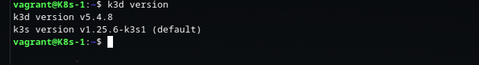

# LAB-01

## Trabajando con Pods

Vamos a crear nuestro primer Pod, y para ellos vamos a desplegar una
imagen que nos ofrece un servidor web con una página estática. 

1. Crea un archivo yaml con la descripción del recurso Pod, teniendo en cuenta los siguientes aspectos:
    * Indica nombres distintos para el Pod y para el contenedor.
    * La imagen que debes desplegar es `roxsross12/k8s_test_web:latest`.
    * Indica una etiqueta en la descripción del Pod.
2. Crea el Pod.
3. Comprueba que el Pod se ha creado y está corriendo.
4. Obtén información detallada del Pod creado.
5. Accede de forma interactiva al Pod y comprueba los archivos que están en el DocumentRoot (`usr/local/apache2/htdocs/`).
6. Crea una redirección con `kubectl port-forward` utilizando el puerto de localhost 8888 y sabiendo que el Pod ofrece el servicio en el puerto 80. Accede a la aplicación desde un navegador.
7. Muestra los logs del Pod y comprueba que se visualizan los logs de los accesos que hemos realizado en el punto anterior.
8. Elimina el Pod, y comprueba que ha sido eliminado.

Para superar el desafio deberás entregar en un unico repositorio de github en formato [markdown](https://docs.github.com/es/get-started/writing-on-github/getting-started-with-writing-and-formatting-on-github/basic-writing-and-formatting-syntax):

1. Archivo yaml que has creado con la definición del Pod (**pod.yaml**).
2. Imagen donde se comprueba que el Pod ha sido creado (**imagen1.jpg**).
3. Imagen donde se ve la información detallada del Pod (**imagen2.jpg**).
4. Imagen donde se ve el archivo `index.html` del DocumentRoot (**imagen3.jpg**).
5. Imagen del navegador accediendo a la aplicación con el `port-forward` (**imagen4.jpg**).
6. Imagen donde se ve los logs de acceso del Pod (**imagen5.jpg**).


### Resolución

# Kubernetes

## Intro

Ya tenemos varias imagenes del capítulo anterior, ahora queremos llevar todas esas imagenes y contenedores  a Kubernetes, ¿cómo seguimos?

Kubernetes puede ser instalado de muchas formas, e incluso instanciado en servicios de las distintas nubes públicas como AWS Elastic Kubernetes Services (EKS), Azure Kubernetes Service (AKS), Google Kubernetes Engine (GKE), entre otros. Dado que los servicios en la nube cuestan dinero, podemos empezar con algo sencillo de forma local.

Poder hacer uso de Kubernetes de forma local en tu ordenador es sorprendente. Primero porque te acerca a la tecnología sin una barrera inicial alta (como sería el costo de usarlo), y segundo porque cada vez el proceso es más sencillo, al punto tal que con un comando podemos crear un cluster con varios nodos... todo en un solo ordenador.

## Instalacion de Kubernetes en local

Kubernetes tiene muchísimas opciones para instalar en local, de forma fácil y rápida. Si van a cualquier guía, seguramente se encontrarán con las opciones de microk8s, minikube, kind, k3d, k3s.

Para las pruebas que utilize, fue armar un cluster de kubernetes con K3s y luego usar openlens (opcional) para administralo o ver pods, deployments and replicasset en forma grafica




## Primer pod de prueba


Como verán, una vez dentro del pod, el host se reconoce a si mismo como "mi-pod", igual que el nombre de nuestro pod. Por otro lado, varios comandos fallan, porque en la imagen no fueron incluidos (más adelante explicaremos los motivos). Si corremos un `df`, veremos varias cosas intersantes como que el espacio que refleja el `/` es el mismo que nuestro ordenador, y que cuenta con un `/etc/hosts` montado, que está por encima del archivo real de nuestro host. 

El siguiente paso es exponer nuestro `pod` de forma fácil, con un `port-forward`.

```bash
# Con 8080 especificamos el puerto local, y 80 el puerto del pod al que conectamos
╰─ kubectl port-forward mi-pod 8080:80 --address=0.0.0.0
Forwarding from 0.0.0.0:8080 -> 80
Forwarding from [::1]:8080 -> 80
# Una vez probado el acceso via browser, podemos matar el proceso con CTRL+C
```

## Pod de Rossana

Se pide crear un archivo yaml para el pod, donde podemos optar por dos opciones: una creando el archivo yaml desde cero o la otra opción es mediante la ayuda de kubectl, en mi caso, opte crear el archivo yaml mediante kubectl

```bash
# Con dry-run=client, simulamos una acción, y con -o yaml exportamos la salida a ese formato
kubectl run rossana-pod --image=roxsross12/k8s_test_web:latest --dry-run=client -o yaml > rossana-pod.yaml
# Esto nos genera el archivo: rossana-pod.yaml
```

rossana-pod.yaml

```
apiVersion: v1
kind: Pod
metadata:
  creationTimestamp: null
  labels:
    run: rossana-pod
  name: rossana-pod
spec:
  containers:
  - image: roxsross12/k8s_test_web:latest
    name: rossana-pod
    resources: {}
  dnsPolicy: ClusterFirst
  restartPolicy: Never
status: {}
```

Una vez creado el archivo rossana-pod.yaml ejecutarlo y exponerlo en el puerto 8888:

```bash
kubectl apply -f rossana-pod.yaml
kubectl port-forward rossana-pod 8888:80 --address=0.0.0.0
```

Chequear que los pods esten corriendo:

```bash
kubectl get pods -A 
```


Luego apuntarle al browser al puerto 8888 para mostrar la app:


Accder de forma detalla al pod de rossana y comprobrar que en el directorio /usr/local/apach2/htdocs se encuentra el archivo index.html


```bash
kubectl exec -ti rossana-pod sh
```

Ver los logs del pod cuando accedemos al puerto 8888:

```bash
kubectl logs rossana-pod -f
```


Por último, eliminar el pod:


```bash
kubectl delete pod rossana-pod
```


