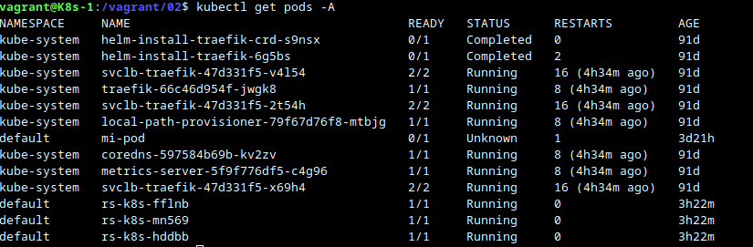

# LAB-02

## ReplicaSet

1. Crea un archivo yaml con la descripción del recurso ReplicaSet, teniendo en cuenta los siguientes aspectos:
    * Indica nombres distintos para el ReplicaSet y para el contenedor de los Pods que va a controlar.
    * El ReplicaSet va a crear 3 réplicas.
    * La imagen que debes desplegar es `roxsross12/k8s_test_web:latest`.
    * Indica de manera adecuada una etiqueta en la especificación del Pod que vas a definir que coincida con el *selector* del ReplicaSet.
2. Crea el ReplicaSet.
3. Comprueba que se ha creado el ReplicaSet y los 3 Pods.
4. Obtén información detallada del ReplicaSet creado.
5. Vamos a probar la tolerancia a fallos: Elimina uno de los 3 Pods, y comprueba que inmediatamente se ha vuelto a crear un nuevo Pod.
6. Vamos a comprobar la escalabilidad: escala el ReplicaSet para tener 6 Pods de la aplicación.
7. Elimina el ReplicaSet y comprueba que se han borrado todos los Pods.

Para superar el desafio deberás entregar en un unico repositorio de github en formato [markdown](https://docs.github.com/es/get-started/writing-on-github/getting-started-with-writing-and-formatting-on-github/basic-writing-and-formatting-syntax):

1. Archivo yaml que has creado con la definición del ReplicaSet (**rs.yml**).
2. imagen donde se comprueba que el ReplicaSet y los 3 Pods se han creado (**imagen2.jpg**).
3. imagen donde se ve la información detallada del ReplicaSet (**imagen3.jpg**).
4. imagen donde se ven los Pods que se han creado, después de eliminar uno de ellos (**imagen4.jpg**).
5. imagen donde se ven los Pods que se han creado después del escalado (**imagen5.jpg**).


### A modo de repaso

##### Replicaset

Los ReplicaSet tienen como principal objetivo garantizar una determinada cantidad de pods corriendo al mismo tiempo. Por lo tanto,, nos asegura que un conjunto de pods siempre están funcionando y disponibles. Nos proporciona las siguientes características :

- Que no hay caído el servicio
- Tolerancia a errores
- Escalabilidad dinámica 

##### Definición yaml de un replicaset como ejemplo

```bash
apiVersion: apps/v1
kind: ReplicaSet
metadata:
  name: nginx
  labels:
    app: nginx
spec:
  replicas: 3
  selector:
    matchLabels:
      app: nginx
  template:
    metadata:
      labels:
        app: nginx
    spec:
      containers:
      - name: nginx
        image: nginx  
```

* replicas: Indicamos el número de pos que siempre se van a estar ejecutando.
* selector: Indicamos el pods que vamos a replicar y vamos a controlar con el ReplicaSet. En este caso va a controlar pods que tenga un label app cuyo valor sea nginx. Si no se indica el campo selector se seleccionan por defecto los pods cuyos labels sean iguales a los que hemos declarado en la sección siguiente.
* template: El recurso ReplicaSet contiene la definición de un pod.

### Resolución

1. Crear un archivo replicaset  con las características mencionadas

replicaset.yaml

```bash
apiVersion: apps/v1
kind: ReplicaSet
metadata:
  name: rs-k8s
  labels:
    app: k8stest
spec:
  replicas: 3
  selector:
    matchLabels:
      app: k8stest
  template:
    metadata:
      labels:
        app: k8stest
    spec:
      containers:
      - name: k8stest
        image: roxsross12/k8s_test_web:latest   
```

2. Crear el ReplicaSet

```bash
kubectl create -f replicaset.yaml
```
3. Comprobrar que se ha creado el replicaset y los pods

```bash
kubectl get rs
```
```bash
kubectl get pods -A
```


4. Información detallada del replicaset

```bash
kubectl describe rs
```


5. Eliminar un pod y ver como se crea uno inmediatamente

Screenshot antes de eliminar un pod



```bash
kubectl delete pod rs-k8s-hddbb
```

Screenshot después de eliminar uno de los pod


6. Comprobar la escalabilidad a 5 pod

```bash
kubectl scale rs rs-k8s --replicas=5
```


7. Eliminar el replicaset y comprobar que se han eliminado todos los pods

```bash
kubectl delete rs rs-k8s
```
